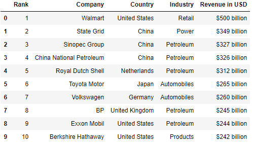
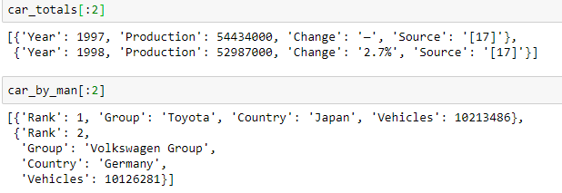

# 🧲 İnternet Üzerinden Veri Çekme

## 💨 URL'den Veri Alma

Veri almanın en hızlı ve basit yolu

```python
import urllib.request
contents = urllib.request.urlopen("http://example.com/foo/bar").read()

# Encoding işlemi için (https://stackoverflow.com/a/17615424/9770490)
encoding = "utf-8"
contents = contents.decode(encoding)
```

## 🆔 Web Kimliği `UserAgent` Ayarlama

* Bazı web siteleri, isteklerin nereden geldiğini bilmeden hareket edemezler. 
* Bu sebeple isteği detaylandırmamız gerekmektedir.
* `UserAgent` ile hangi tarayıcıdan ve bilgisayardan bağlandığımızı belli ederiz

> `HTML` alanına bağlantıyı yazın, `pd.read_html(html)` şeklinde kullanın

```python
from urllib.request import urlopen, Request

HTML = "" # Örn: https://en.wikipedia.org/

headers = {'User-Agent': 'Mozilla/5.0 (Windows NT 6.1) AppleWebKit/537.36 (KHTML, like Gecko) Chrome/41.0.2228.0 Safari/537.3'}
reg_url = HTML
req = Request(url=reg_url, headers=headers) 
html = urlopen(req).read() # Pandas için kullanılacak html objesi
```


‍🧙‍♂ Detaylı bilgi için  ["\[Python\]\[Crawler\]“HTTP Error 403: Forbidden”](https://medium.com/@speedforcerun/python-crawler-http-error-403-forbidden-1623ae9ba0f) alanına bakabilirsin.


## 🧐 Tarayıcı Üzerinden Veriyi Bulma

* CTRL + SHIFT + C kısayolu ile aradığınız elemanı ona tıklayarak seçin
* Elements ekranından açılan satıra sağ tıklayın ve Copy → Copy selector deyin
* Gelen metni bir notepad gibi bir yere kaydedin


## 🐍 Python Kodu ile Veriyi Çekme

* `pip install beautifulsoup4` komutu ile html verilerini işleme paketi olan `bs4` paketini indirin
* `pip install requests` ile html isteklerini yönetme paketi olan `requests` paketini indirin
* Daha önceden kopyaladığınız **selector** verisini ve veriyi aldığınız url bilgisini sırasıyla `SELECTOR` ve `URL` objelerine atayın
* İlk olarak kendimizi tanıttığımız `headers` verileri ile `GET` isteği atıp, içeriği alıyoruz ve ardından `soup` objemiz ile istediğim **selector** ile elemanı alıyoruz

```python
import requests
from bs4 import BeautifulSoup

SELECTOR = "#answer-24801950 > div > div.votecell.post-layout--left > div > div.js-vote-count.grid--cell.fc-black-500.fs-title.grid.fd-column.ai-center"
URL = "https://stackoverflow.com/questions/24801548/how-to-use-css-selectors-to-retrieve-specific-links-lying-in-some-class-using-be"

html = requests.get(
    URL,
    headers={
        'User-Agent':
        'Mozilla/5.0 (Windows NT 10.0; Win64; x64) AppleWebKit/537.36 (KHTML, like Gecko) Chrome/86.0.4240.111 Safari/537.36 Edg/86.0.622.58',
    }
).text.encode("utf-8")
soup = BeautifulSoup(html, "html.parser")
selected_element = soup.select_one(SELECTOR)
```

## 📅 Tablo Verisi Alma

* Web siteleri üzerindeki tabloları çekmek için `pd.read_html` kullanılır
* Tüm tablo verileri arasında `0`, `1` ... değerleri ile gezinebiliriz.

```python
import pandas as pd
import json
df = pd.read_html('https://en.wikipedia.org/w/index.php?title=Fortune_Global_500&oldid=855890446', header=0)[1]
fortune_500 = json.loads(df.to_json(orient="records"))
df
```



```python
df_list = pd.read_html("https://en.wikipedia.org/w/index.php?title=Automotive_industry&oldid=875776152", header=0)
car_totals = json.loads(df_list[1].to_json(orient="records"))
car_by_man = json.loads(df_list[3].to_json(orient='records'))
```



## 👮‍♂️ Verilerin Sağlaması Gereken Özellikler

* Günlük hayatta veriler istediğimiz kadar basit olmaz, bunlar üzerinde işlemler yaparak uygun hale getiririz
* Tek tablodan oluşan basit veya bağlantılı bir kaç tablodan oluşan
  * Farklı veriler için _mapping_ ile veri tipleri birbirine benzetilir
* Kolay analiz edilebilir formatta olan
* Makine öğrenimine sokulabilecek veriler
* Düşük karmaşıklığa sahip
* Yüksek boyutlu veriler için optimizasyon

